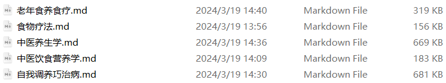
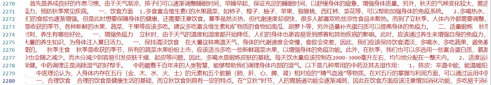

# 数据集介绍

## RAG数据集

### 自建

医学电子书-养生保健类：《老年食养食疗》、《食物疗法》、《中医养生学》、《中医饮食营养学》、《自我调养巧治病》

### 开源引用

## 微调数据集

### 自建

Traditional Chinese Medicine Health 七类数据（饮食养生、四季养生、养生保健、运动养生、养身常识、中医养生、膳食养生、中医常识）

### 开源引用

> *所有数据之后会开源*
