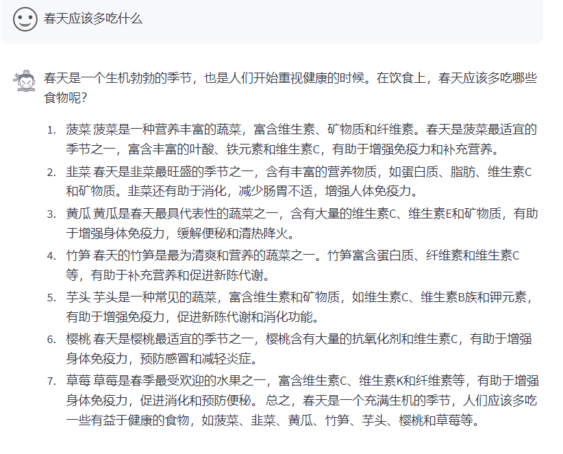
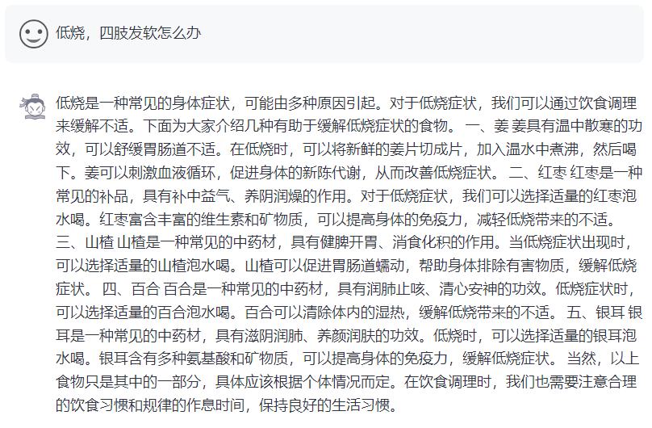

## Data

中医网站文章共1w6篇，通过InternLM-7b对标题进行改写，生成贴合人类语气的问题

## 对比

lora微调，epoch=3

| 微调前              | 微调后             |
| ------------------- | ------------------ |
|  |  |
|  |  |

## 思考

由于数据来自同一网站，微调之后有过拟合的情况。
